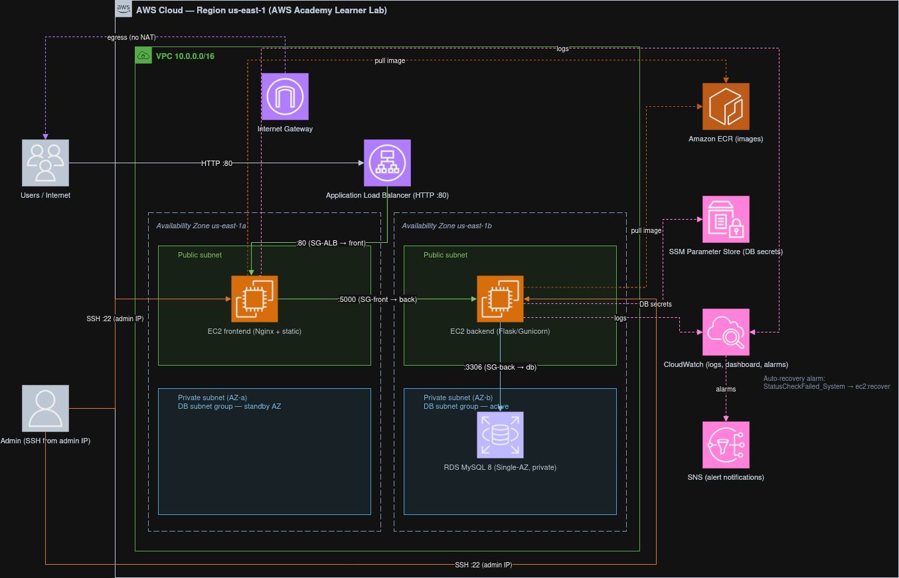

## Presentation du projet

Ce projet met en œuvre une chaîne **DevOps + AWS** complète autour d'une application
support **Pomodoro** à 3 tiers.

- **Application** : `frontend` (HTML/CSS/JS statique servi par Nginx, qui reverse-proxy
  `/api/*`), `backend` (API REST Flask/Gunicorn, **sans état**), `db` (MySQL 8).
- **Environnement AWS** : **AWS Academy Learner Lab**, région `us-east-1`.
- **Équipe** : Corentin Dupaigne
- **Dépôt** : [corentin-dupaigne/devops_aws](https://github.com/corentin-dupaigne/devops_aws)

---

## Architecture AWS

L'architecture mappe les 3 tiers de l'application sur AWS, répartie sur **2 zones de
disponibilité** pour la résilience, avec un point d'entrée unique (ALB) et une base de
données managée isolée.

- **Compute** : 2 EC2 statiques (Amazon Linux 2023), résilience assurée par une **alarme
  CloudWatch d'auto-recovery** (`StatusCheckFailed_System → ec2:recover`).
- **Exposition** : ALB en subnets publics ; seul le frontend est enregistré comme cible,
  le backend reste interne (Nginx le proxifie sur son IP privée).
- **Données** : RDS MySQL 8 en subnets privés, `publicly_accessible = false`.
- **Contrainte Learner Lab** : pas de NAT (egress des EC2 via l'Internet Gateway),
  réutilisation de `LabRole`/`LabInstanceProfile` (création de rôles IAM interdite).

### EC2s

### RDS

### ALB

---

## Reseau & moindre privilege

Le moindre privilège sur les flux est porté par des **Security Groups en cascade** :
chaque tier n'accepte que le SG du tier au-dessus, sans aucun CIDR ouvert entre tiers.

| SG                           | Flux entrant | Source autorisée                         |
| ---------------------------- | ------------ | ---------------------------------------- |
| `SG-ALB`                     | TCP 80       | `0.0.0.0/0` (seul point d'entrée public) |
| `SG-frontend`                | TCP 80       | `SG-ALB` uniquement                      |
| `SG-backend`                 | TCP 5000     | `SG-frontend` uniquement                 |
| `SG-db`                      | TCP 3306     | `SG-backend` uniquement                  |
| `SG-frontend` / `SG-backend` | TCP 22       | `<IP_ADMIN>/32` uniquement               |

Points clés :
- **RDS structurellement injoignable depuis Internet** (subnets privés sans route 0.0.0.0/0).
- **SSH fermé à tous sauf l'IP d'admin** (pas de bastion, pas d'accès SSH public).
- **VPC réparti sur 2 AZ** (subnets publics et privés dans chaque AZ).

### Security Groups

### Inbound Rules

- Backend

- DB

- Frontend

### Subnets

---

## Infrastructure as Code (Terraform)

Toute l'infrastructure AWS est décrite en **Terraform**, découpée en modules :

| Module          | Contenu                                                        |
| --------------- | -------------------------------------------------------------- |
| `network`       | VPC, subnets 2 AZ, IGW, routes, Security Groups en cascade     |
| `data`          | RDS MySQL, mot de passe généré, paramètres SSM                 |
| `compute`       | EC2 front/back, ALB + target group, ECR, alarmes auto-recovery |
| `observability` | Log groups, dashboard CloudWatch, SNS + alarmes                |

- **State local** (projet solo, `apply` depuis le laptop avec les creds frais du lab).
- **IAM** : `LabRole`/`LabInstanceProfile` référencés via data sources (jamais créés).
- **Secrets** : mot de passe RDS **généré** (`random_password`) et stocké en **SSM
  SecureString** — aucun secret en clair dans le dépôt.
- Qualité IaC vérifiée par `terraform fmt`, `terraform validate` et `tflint`.

### terraform apply sortie

### Arborescence du dossier terraform

---

## Configuration (Ansible)

Le déploiement applicatif sur les EC2 est entièrement automatisé par **Ansible**, organisé
en rôles :

| Rôle       | Tâches                                                                          |
| ---------- | ------------------------------------------------------------------------------- |
| `common`   | Installation Docker, garde AWS CLI, authentification ECR (via instance profile) |
| `backend`  | Lecture des secrets SSM, chargement du schéma `init.sql`, conteneur Flask       |
| `frontend` | `nginx.conf` templaté (IP privée du backend), conteneur Nginx                   |

- **Transport SSH** restreint à l'IP d'admin (cohérent avec le SG port 22).
- **Inventaire statique** généré depuis les outputs Terraform (`generate-inventory.sh`).
- **Secrets** lus depuis SSM **sur l'hôte** (instance profile), injectés par env-file
  `0600`, jamais affichés (`no_log`).
- **Logs** des conteneurs envoyés à CloudWatch via le log-driver `awslogs`.

### Sortie ansible-playbook site.yml

---

## DevSecOps

Une chaîne **GitHub Actions** exécute les portes de qualité et de sécurité à chaque push
et pull request, **sans aucun credential AWS** (la CI ne touche jamais au lab).

| Job          | Outils                                                            |
| ------------ | ----------------------------------------------------------------- |
| `lint`       | `terraform fmt`/`validate`, `tflint`, `hadolint`, `ruff`, `black` |
| `secrets`    | `gitleaks` (détection de secrets)                                 |
| `build-scan` | build des images + `trivy` (scan de vulnérabilités des images)    |
| `iac-scan`   | `trivy config` + `checkov` (scan de l'IaC)                        |
| `deps-sast`  | `pip-audit` (dépendances) + `semgrep` (SAST) — bonus              |

Les scanners produisent des **rapports** publiés en *artifacts*. Les portes bloquantes
(secrets, lint, format) garantissent la qualité avant merge.

### Workflow CI

### Rapport Trivy (IAC)

---

## Monitoring & logs

L'observabilité repose sur **Amazon CloudWatch** (choix assumé d'un seul outil managé
plutôt qu'une stack Prometheus/Grafana redondante) :

- **Logs centralisés** : log groups `/pomodoro/frontend` et `/pomodoro/backend` alimentés
  par le log-driver `awslogs` des conteneurs.
- **Dashboard** `pomodoro-dashboard` : ALB (requêtes, 5xx, latence, santé des cibles),
  EC2 (CPU front/back), RDS (CPU, connexions, espace disque).
- **Alarmes → SNS** : ALB 5xx, hôtes *unhealthy*, CPU RDS élevé.

### Dashboard

### Logs (backend)

### Alarms

---

## Choix techniques & compromis

| Compromis                     | Raison                      | Compensation / future-work                                    |
| ----------------------------- | --------------------------- | ------------------------------------------------------------- |
| EC2 en subnets **publics**    | Pas de NAT (budget lab)     | SG en cascade + SSH restreint à l'IP admin ; RDS reste privée |
| **EC2 statiques** (pas d'ASG) | Simplicité / budget         | Auto-recovery par alarme CloudWatch ; ASG = future-work       |
| RDS **Single-AZ**             | Budget / quotas lab         | Multi-AZ = 1 ligne Terraform à activer                        |
| **HTTP** sur l'ALB            | Pas de domaine              | ACM + Route53 en future-work                                  |
| IAM via **LabRole**           | Création de rôles interdite | Moindre privilège porté par les Security Groups               |
| **State Terraform local**     | Projet solo                 | Backend S3 + DynamoDB pour un travail en équipe               |
| **Pas de Prometheus/Grafana** | Doublon CloudWatch          | CloudWatch couvre métriques, logs et alarmes                  |
